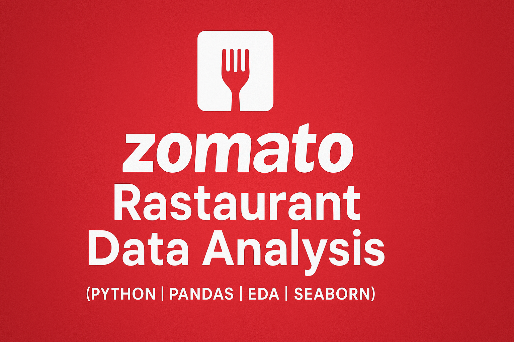

# 🍽️ Zomato Restaurant Data Analysis using Python

This project analyzes Zomato's Bangalore restaurant dataset to uncover insights about customer behavior, popular cuisines, location-based trends, and service facilities. It uses Python libraries like Pandas, Seaborn, and Matplotlib to perform a complete exploratory data analysis (EDA).

---

## 📌 Objectives

- Analyze restaurant trends across different locations in Bangalore
- Identify most popular cuisines and restaurant types
- Visualize the impact of online ordering and table booking
- Study cost, ratings, and votes to discover what drives customer interest

---

## 🧰 Tools & Technologies

- **Python**
- **Pandas**
- **NumPy**
- **Matplotlib**
- **Seaborn**
- **Jupyter Notebook**

---

## 📊 Key Visualizations & Insights

1. 📍 Top restaurant-concentrated locations
2. 🍜 Most popular cuisines (votes-wise)
3. ✅ Online order & table booking availability
4. 💸 Cost vs Rating vs Votes correlation
5. 🔥 Cuisine-wise ratings
6. 🗳️ Votes by location
7. 📈 Distribution of ratings
8. 🌡️ Heatmaps for location vs ratings
9. 📊 Type of restaurant by location
10. 🎯 Overall key insights + conclusion

---

## 📂 Dataset

> Dataset Source: [Zomato Restaurants Bangalore – Kaggle](https://www.kaggle.com/datasets/ashishbansal/zomato-bangalore-restaurants)

---

## 📌 Final Insights

- **North Indian** and **Chinese** are the most voted cuisines.
- **Koramangala**, **BTM**, and **Indiranagar** have the most restaurants.
- **Online ordering** boosts vote count and customer engagement.
- Restaurants with both **online ordering and booking** have higher ratings.

---

## Files in This Repo

| File                          | Description                            |
|-------------------------------|----------------------------------------|
| `Zomato_Bangalore_Analysis.ipynb` | Main Jupyter notebook with full EDA |
| `Zomato_Bangalore_Analysis.pdf`   | Exported PDF version (for recruiters) |
| `thumbnail.png`              | Project banner image                   |
| `README.md`                  | Project overview (this file)           |

---

## Author

**Chintu** – Aspiring Data Analyst  
[varshithreddie2003@gmail.com]  
[https://www.linkedin.com/in/varshith-reddy-577896373/]

---

## Like this project?

Star the repo and connect with me on [LinkedIn](https://www.linkedin.com/in/varshith-reddy-577896373/) for more cool projects and collaborations!
